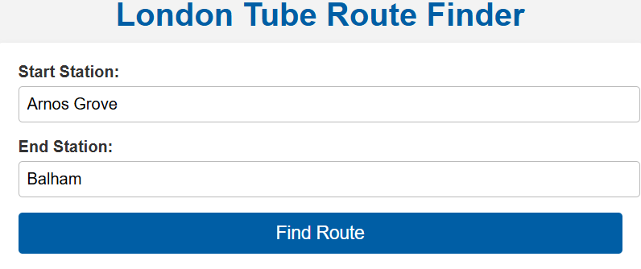
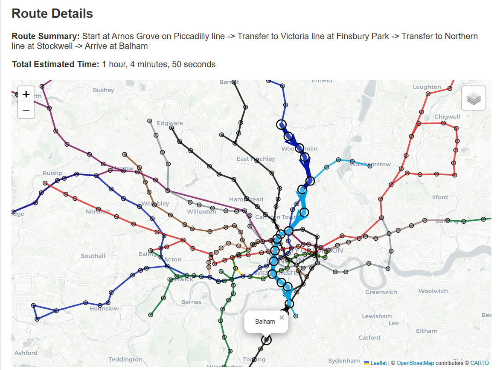

# Tube Map Route Finder

This project provides a web application that allows users to find a fast route between two stations on the London Underground. By entering a start and end station, users can visualise the route on an interactive map along with a journey summary.

Please note, this code is not intended for actual journey planning; the information provided is a way to visualise the London Underground System as a graph, and is not as accurate as other tools such as Google Maps. 

This project is in no way affiliated with Transport for London.

## Features

- **Route Visualisation**: Display the shortest path on a map using Folium.
- **Journey Summary**: Provides details of the route, including travel times and transfers.
- **Shortest Path Calculation**: Utilizes Dijkstra's algorithm to determine the most efficient route between stations.

## Model Overview

The model considers both travel times and transfer times when calculating the optimal route. Key aspects include:

- **Travel Times**: Estimated based on the distance between adjacent stations, using the Haversine Formula to compute direct distances. Primary data was used to tune parameters of the estimation. 
- **Transfer Times**: Calculated with the formula:

  $$
  T = \sqrt{\frac{d}{2}} \times 60 + \frac{T_{between}}{2}
  $$

  where $d$ is the number of neighbouring stations and $T_{between}$ is the average time between trains on the new line.

The combination of these factors allows for accurate modeling of the journey times across the Tube network.

## Usage

1. Enter the start and end stations in the input fields.
2. Click the "Find Route" button.
3. View the optimal route displayed on the map along with the journey summary.


 

## Installation

To run this project locally, follow these steps:

1. Clone the repository:

   ```bash
   git clone https://github.com/AnangoPrabhat/Tube-Graph.git
   ```


## Acknowledgments

Development of this project utilised OpenAI's GPT-o3 Mini for its reasoning capabilities. The following files incorporate its code:

- **app.py**: Implements the main logic using GPT-o3 Mini.
- **index.html & styles.css**: Frontend design elements guided by GPT-o3 Mini's suggestions.

